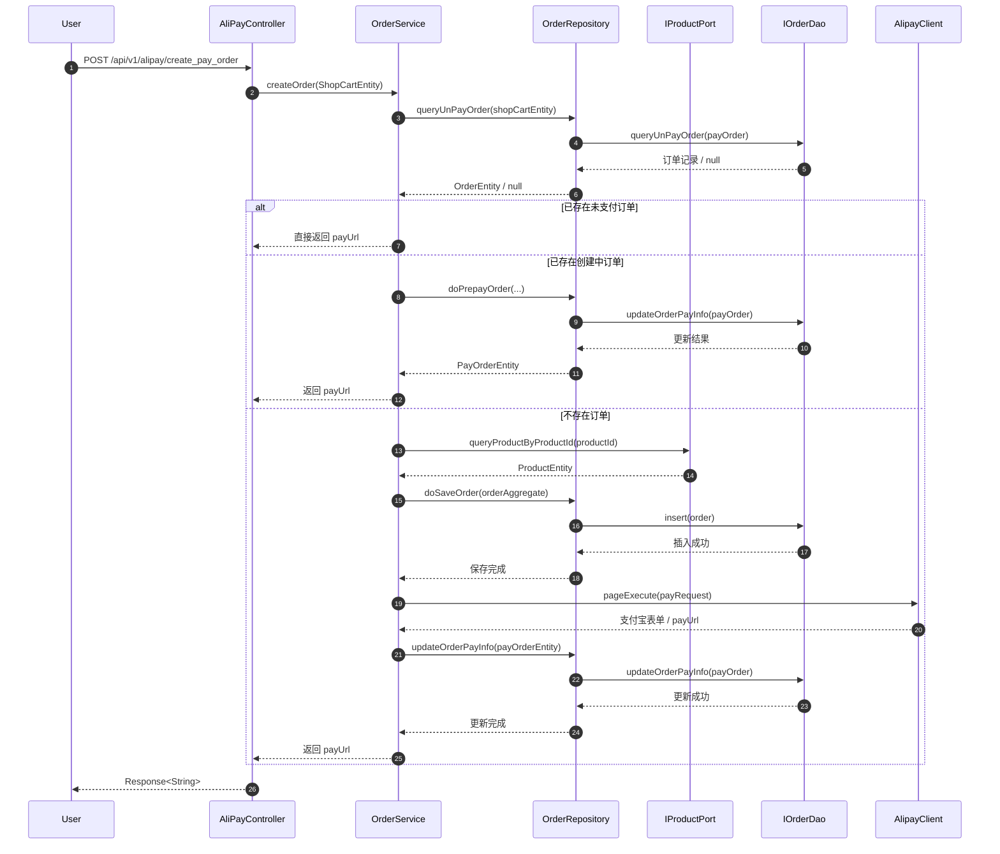

# 订单下单流程时序图说明

本文档用于把“商品下单 -> 生成支付单 -> 返回支付链接”的流程画清楚，便于汇报、答辩和后续排查问题。

## 1. 核心入口

用户下单的入口是：

- `AliPayController.createPayOrder`

它会把前端传入的 `userId`、`productId` 组装成 `ShopCartEntity`，然后调用领域服务：

- `IOrderService.createOrder`

## 2. 时序图

## 3. 流程拆解

### 3.1 入口层

`AliPayController` 只负责：

- 接收请求
- 组装 `ShopCartEntity`
- 调用领域服务
- 返回统一响应体

它不应该承担订单规则判断，也不应该直接访问数据库。

### 3.2 领域层

`OrderService` 负责下单主流程：

1. 先查是否存在未支付订单
2. 再判断是否存在已创建但未生成支付单的订单
3. 如果都没有，再查商品信息
4. 构造订单聚合
5. 保存订单
6. 调用支付宝生成支付单
7. 回写支付信息

领域层是整个下单逻辑的核心，业务判断都应该放在这里。

### 3.3 仓储层

`OrderRepository` 负责：

- 领域对象和持久化对象之间的转换
- 调用 `IOrderDao` 执行数据库操作
- 保存订单、更新支付信息、查询未支付订单

它只做数据访问和适配，不承载业务规则。

### 3.4 外部能力

`IProductPort` 用于查询商品信息，支付能力则由 `AlipayClient` 提供。

这两类能力都属于外部依赖，领域层只依赖抽象接口或由应用层注入的能力对象。

## 4. 三种典型结果

### 4.1 首次下单

流程：

1. 未查到订单
2. 查询商品信息
3. 创建订单
4. 生成支付单
5. 回写支付链接
6. 返回支付链接

### 4.2 重复下单

流程：

1. 查到未支付订单
2. 直接返回已有支付链接
3. 避免重复创建订单和支付单

### 4.3 订单已创建但支付单未生成

流程：

1. 查到订单状态为 `CREATE`
2. 重新生成支付单
3. 更新订单支付信息
4. 返回支付链接

## 5. 这次启动报错和流程的关系

这次启动失败的根因是：

- `OrderService` 需要注入 `IOrderRepository`
- 但 `OrderRepository` 没有被 Spring 注册成 Bean

所以不是业务流程写错，而是仓储实现没进入容器。

本次已补上：

- `@Repository`

这样整个下单链路才能从入口层一路调用到仓储层和支付层。

## 6. 汇报时可以直接用的一句话

可以把这条链路概括成：

> Controller 接收下单请求，领域服务先查重复订单，再查商品并构造订单聚合，仓储保存订单后调用支付宝生成预支付单，最后回写支付信息并返回支付链接。

